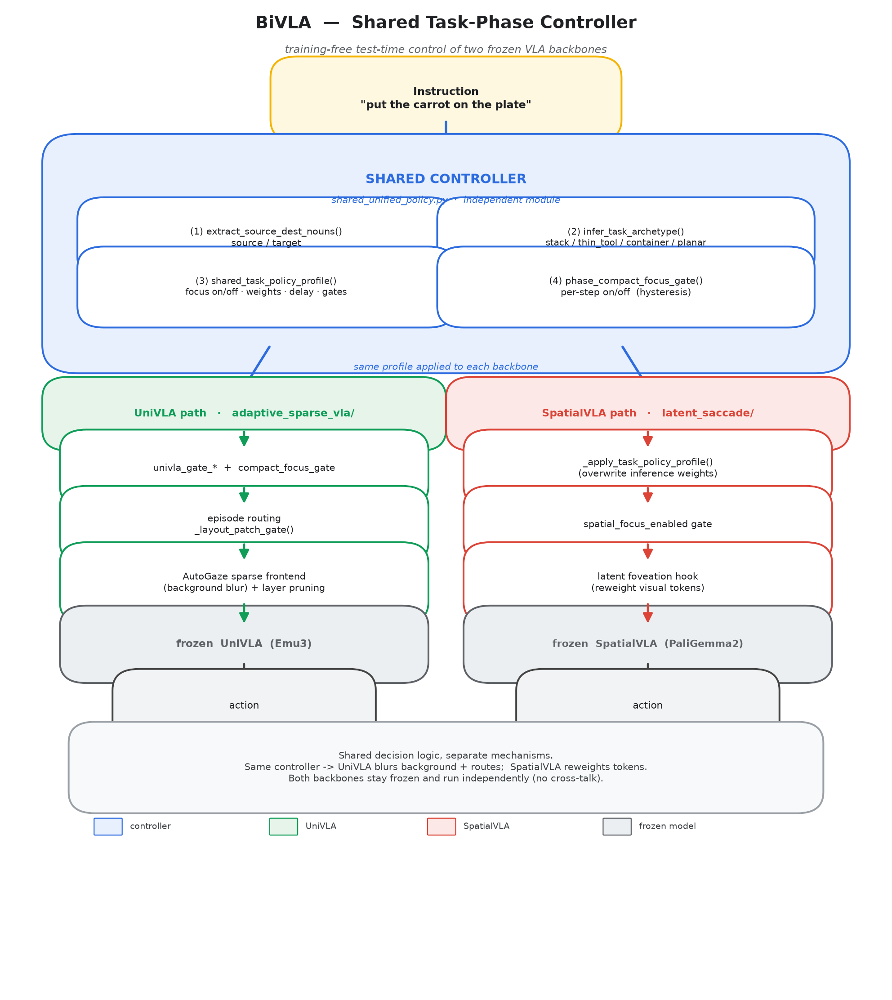
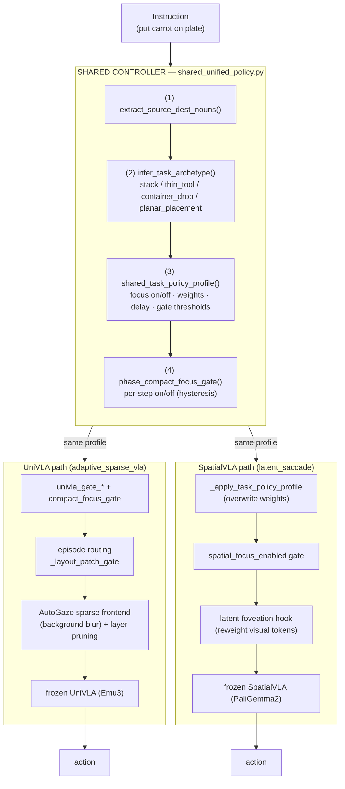

# Test-Time Control for Frozen UniVLA and SpatialVLA

This repository contains a compact research codebase for **training-free test-time control of frozen vision-language-action models**. The project centers on one shared idea:

> use a **task-phase controller** to decide when visual focus should be sharpened, when the policy should stay in its baseline mode, and how that decision should differ across manipulation archetypes.

The codebase supports two frozen policy backbones:

- **UniVLA**
- **SpatialVLA**

The final repository only keeps the code required to reproduce the published inference paths. Large bundled checkpoints have been removed from the repo and must be downloaded separately.

## 1. Overview

### Problem

Frozen VLA policies often fail for different reasons on different manipulation tasks:

- some tasks are limited by **coarse visual localization**
- some are limited by **placement precision**
- some are limited by **motor execution**, where stronger visual intervention does not help

Applying one global test-time trick across all tasks is usually unstable. In our experiments, naive uniform sparsification or uniform latent foveation often improved one task while regressing others.

### Main idea

We introduce a **shared task-phase controller** that maps an instruction into a coarse manipulation archetype and then controls the inference frontend accordingly:

- for **UniVLA**, the controller chooses when to route an episode into a compact-focus sparse frontend
- for **SpatialVLA**, the controller decides whether latent visual focus should be enabled at all, and if so, how it should behave across grasp and place phases

The key design principle is not to force both backbones to use identical low-level mechanics. Instead, both backbones share the **same decision policy family**:

1. infer task archetype from instruction
2. infer current manipulation phase
3. activate only the intervention that is appropriate for that archetype and phase
4. preserve baseline behavior when intervention is not justified

### Architecture

The controller is a single independent module (`shared_unified_policy.py`). It reads the
instruction, classifies the task, and decides *whether / when / how strongly* to intervene.
The **same** profile is then applied to both frozen backbones, but each backbone realizes it
through a different mechanism — UniVLA blurs the background and routes the episode, while
SpatialVLA reweights visual tokens. The two backbones stay frozen and run independently.



<details>
<summary>Mermaid source (editable)</summary>



</details>

## 2. Method

### 2.1 Shared Task-Phase Controller


It contains:

- noun extraction from language instruction
- task archetype inference
- phase-aware focus schedules
- focus gating state

The controller groups tasks into a small set of archetypes:

- `container_drop`
  Example: eggplant into basket
- `planar_placement`
  Example: carrot on plate
- `stack_alignment`
  Example: green block on yellow block
- `thin_tool`
  Example: spoon on towel

Each archetype defines a different test-time policy:

- whether visual focus should be enabled at all
- whether grasp-phase focus is allowed
- how long place-phase focus should be delayed
- what area prior and confidence prior should be enforced
- whether UniVLA should remain baseline or route to compact sparse focus

### 2.2 UniVLA Path


The UniVLA path combines:

- baseline frozen UniVLA inference
- adaptive sparse image preparation
- mask reuse with refresh stride
- compact-focus routing
- decoder-layer pruning in the sparse branch

The controller does **episode-level routing**:

- if the initial scene layout matches the compact-focus prior, the episode is routed to the sparse branch
- otherwise it remains in the exact baseline path

This keeps the intervention narrow and prevents suite-wide regressions from indiscriminate sparsification.

### 2.3 SpatialVLA Path

The mechanism is a **latent foveation hook**:

- visual tokens occupy the first `N` positions of the multimodal sequence
- a hook is registered on the decoder input layernorm output
- the hook rescales only visual-patch hidden states
- the policy stack otherwise remains unchanged

This yields a clean comparison:

- same processor
- same model
- same action decoding
- same action ensembling
- different only in the visual-token weighting during prefill

The final selective controller used for SpatialVLA is conservative:

- `container_drop`, `planar_placement`, `thin_tool`: baseline-equivalent behavior
- `stack_alignment`: always-on phase-ready focus during grasp and delayed place

This was necessary because broad latent intervention improved neither efficiency nor reliability on the full 4-task suite.

### 2.4 Why the controller is shared but the mechanics differ

This project does **not** assume that UniVLA and SpatialVLA should share an identical frontend.

Instead, it shares the higher-level policy:

- classify the task
- classify the phase
- decide whether the frozen policy should remain untouched or receive a focused visual intervention

That is the right abstraction boundary because the two backbones differ materially:

- UniVLA responds well to sparse frontends and branch routing
- SpatialVLA responds only weakly to broad latent intervention, and only the stack-like placement case showed measurable upside

## 3. Repository Layout

Relevant top-level directories:

- `adaptive_sparse_vla/`
  UniVLA inference and evaluation code
- `SpatialVLA/`
  SpatialVLA code and latent-focus evaluation path
- `AutoGaze/`
  sparse selector dependency for UniVLA
- `SimplerEnv/`
  simulation environment used in evaluation
- `configs/`
  central runtime paths and rendering config
- `experiments/`
  launch scripts

Removed from the repository:

- bundled top-level pretrained checkpoints

## 4. Setup

### 4.1 Environment

This repo expects:

- Linux
- CUDA GPU
- Conda
- MuJoCo offscreen rendering

The default conda env name in the scripts is `bivla`.

### 4.2 Clone

```bash
git clone <your-repo-url> BiVLA
cd BiVLA
```

### 4.3 Create the conda environment

The exact package set depends on your local stack. At minimum, install:

```bash
conda create -n bivla python=3.10 -y
conda activate bivla
pip install torch torchvision torchaudio
pip install transformers huggingface_hub safetensors pillow numpy transforms3d
pip install gymnasium opencv-python imageio imageio-ffmpeg
```

You will also need the dependencies required by:

- `SimplerEnv`
- `UniVLA`
- `SpatialVLA`
- `AutoGaze`

If you already have the original project environment, reusing it is the safest path.

### 4.4 Download model checkpoints

The repo no longer ships checkpoints. By default, the launcher expects:

```text
pretrain/
  Emu3-VisionTokenizer/
  UNIVLA_SIMPLER_BRIDGE_VIDEO_BS128_20K/
UniVLA/pretrain/
  fast_bridge_t5_s50/
```


Recommended setup:

```bash
mkdir -p pretrain
```

Then populate:

- `pretrain/UNIVLA_SIMPLER_BRIDGE_VIDEO_BS128_20K`
- `pretrain/Emu3-VisionTokenizer`
- `UniVLA/pretrain/fast_bridge_t5_s50`

For SpatialVLA, the evaluator can load directly from Hugging Face:

- `IPEC-COMMUNITY/spatialvla-4b-224-pt`

If you prefer local caching for SpatialVLA, download that model locally and pass `--model-path /path/to/spatialvla-4b-224-pt`.

### 4.5 Validate runtime paths

If checkpoints are missing, the script warns instead of hard failing.

## 5. Running Experiments

### 5.1 UniVLA baseline

```bash
./run_experiment.sh \
  --exp baseline_256 \
  --task widowx_carrot_on_plate \
  --n-episodes 24 \
  --output-dir results/vanilla_baselines/univla_full_suite/widowx_carrot_on_plate
```

### 5.2 UniVLA shared controller

```bash
./run_experiment.sh \
  --exp shared_compact_focus \
  --task widowx_carrot_on_plate \
  --n-episodes 24 \
  --output-dir results/univla_shared_compact_focus/widowx_carrot_on_plate
```

### 5.3 SpatialVLA evaluator

```bash
export SIMPLER_ENV_ROOT=/tmp/SimplerEnv-OpenVLA
export MUJOCO_GL=osmesa
export VK_ICD_FILENAMES="$PWD/configs/nvidia_icd_egl.json"

$HOME/miniconda3/envs/bivla/bin/python \
  SpatialVLA/experiments/latent_saccade/spatialvla_eval.py \
  --model-path IPEC-COMMUNITY/spatialvla-4b-224-pt \
  --task widowx_stack_cube \
  --n-episodes 24 \
  --output-dir results/spatialvla_shared_compact_focus/widowx_stack_cube
```

## 6. Tasks

The evaluation suite contains four WidowX Bridge tasks:

- `widowx_put_eggplant_in_basket`
- `widowx_carrot_on_plate`
- `widowx_stack_cube`
- `widowx_spoon_on_towel`

## 7. Final Results

### 7.1 UniVLA

Full 4-task, 24-episode-per-task suite:

| Method | Success | Avg Steps | Avg Time |
|---|---:|---:|---:|
| Vanilla UniVLA | `79/96 = 82.29%` | `31.583` | `5.8086s` |
| Shared controller | `81/96 = 84.38%` | `30.750` | `5.7883s` |

Per task:

| Task | Vanilla | Shared controller |
|---|---:|---:|
| Eggplant | `24/24`, `26.208`, `4.8593s` | `24/24`, `26.208`, `4.9151s` |
| Carrot | `17/24`, `34.375`, `6.2077s` | `19/24`, `31.042`, `6.0663s` |
| Stack | `18/24`, `34.625`, `6.2591s` | `18/24`, `34.625`, `6.2300s` |
| Spoon | `20/24`, `31.125`, `5.9082s` | `20/24`, `31.125`, `5.9419s` |

### 7.2 SpatialVLA

Full 4-task, 24-episode-per-task suite:

| Method | Success | Avg Steps | Avg Time |
|---|---:|---:|---:|
| Vanilla SpatialVLA | `19/96 = 19.79%` | `68.510` | `27.8757s` |
| Selective shared controller | `20/96 = 20.83%` | `68.812` | `28.4961s` |

Important interpretation:

- the final SpatialVLA controller is intentionally **selective**
- it preserves baseline behavior on eggplant, carrot, and spoon
- it only activates the focus intervention for the stack archetype
- the stack task improved from `5/24` to `6/24`

This means the SpatialVLA policy improved success slightly, but **did not improve steps or wall-clock time**.

