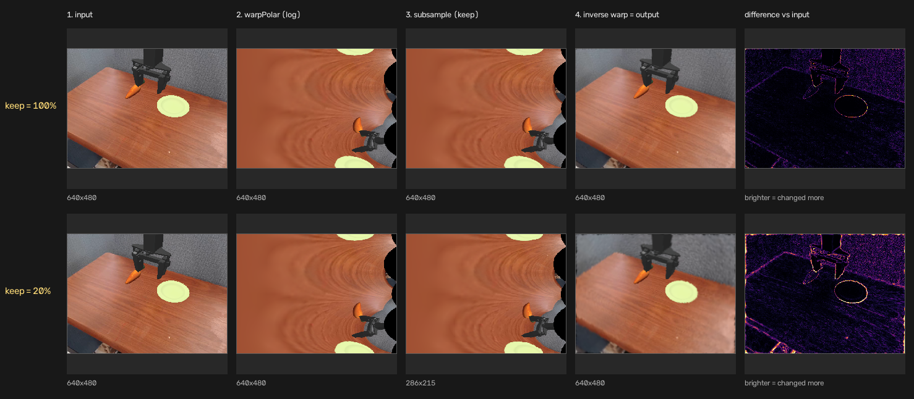
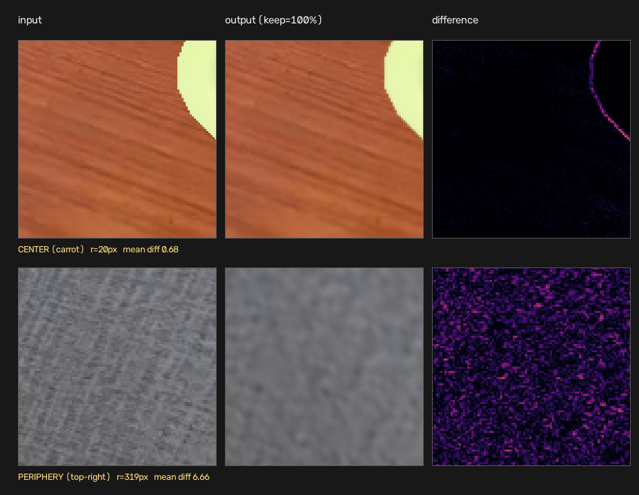

# 이 연구가 무엇이고 지금 어디까지 왔나

> **읽는 데 10분.** 이 문서는 지도이고, 자세한 근거는 아래 둘에 있다. 각 절
> 끝에 "더 보려면" 링크를 달았다.
>
> | 문서 | 무엇 | 분량 |
> |---|---|---|
> | **이 문서** | **연구 전체를 10분에** | ~460줄 |
> | `Report.md` | 어떻게 쟀고(§3) 무엇이 나왔고(§4–6) 무엇이 남았나(§7) | ~2,000줄 |
> | `RelatedWork.md` | 선행연구와 논문별 노트 | ~965줄 |

---

## 한 문장

**VLA 논문들이 "이 방법은 연산을 아끼고 성능은 지킨다"고 보고하는 숫자가,
조건을 조금만 바꾸면 유지되지 않는다는 것을 체계적으로 보인다.**

우리는 새 방법을 만들지 않는다. 이미 있는 개입 셋을 가져와 **같은 프로토콜로
다시 재고**, 그 숫자가 어디까지 버티는지 본다.

---

## 왜 하는가

VLA 정책은 느리다 — 관측 하나에 3초가 걸리는 모델도 있다. 그래서 **학습 없이
추론만 싸게 만드는** 개입이 계속 제안된다. 그런 논문의 주장은 대개 이 형태다:

> 백본 A에 개입 M을 걸었더니 벤치마크 B에서 FLOPs가 X% 줄고 성공률은
> Y%p만 떨어졌다. 따라서 M은 효율적이다.

이 문장이 성립하려면 효과가 **방법의 성질**이어야 한다. 백본이나 벤치마크를
바꿔도 방향이 유지돼야 한다. **우리가 검정하는 것이 정확히 그 전제다.**

---

## 무엇을 쟀나

**개입 셋** — 서로 다른 자원을 건드리도록 골랐다.

| 축 | 무엇을 줄이나 | 우리 개입 |
|---|---|---|
| 시간 | 정책을 **얼마나 자주** 부르나 | action repeat k |
| 시각 | 정책에 **무엇을 보여주나** | foveation (log-polar / blur) |
| 연산 | 한 번에 **신경망을 얼마나 쓰나** | depth pruning k |

**격자** — 백본 3개 × 벤치마크 2개 = **5칸**(UniVLA는 공개 체크포인트가
Bridge 전용이라 한 칸이 빈다), 칸마다 8조건.

| | OpenVLA | SpatialVLA | UniVLA |
|---|:--:|:--:|:--:|
| SimplerEnv **Bridge** (96 ep) | ✓ | ✓ | ✓ |
| SimplerEnv **Fractal** (135 ep) | ✓ | ✓ | — |

**총 7,198 에피소드.** 여기에 "세기를 바꿔가며 쓸어본" 실험과 통제 실험이 붙는다.

**핵심 방법은 짝짓기다.** 성공률 두 개를 빼지 않는다. **같은 초기 상태를
짝지어 결과가 바뀐 에피소드만** 세고 McNemar exact test를 건다. 시뮬이
결정론적이라(재실행이 비트 단위로 동일함을 확인) 실행 간 분산이 0이고, 남는
불확실성은 p값이 전부다.

> 더 보려면 — 개입 명세 `Report.md` §3.0 · 짝짓기 §3.3 · 결정론 §3.4

---

## 격자 전체 — 한눈에

아래가 캠페인의 본체다. **행이 개입, 열이 칸이고, 값은 그 칸의 baseline 대비
성공률 변화(짝지어 잰 값)**다. 굵은 것은 **그 칸 자체의 변화가** 기준을 통과한
여덟 칸이다 — 우리는 42번을 쟀으므로, 우연히 나올 수 있는 것을 걸러내려면
p < 0.0012라야 인정한다.

| | OpenVLA<br>Bridge | OpenVLA<br>Fractal | SpatialVLA<br>Bridge | SpatialVLA<br>Fractal | UniVLA<br>Bridge |
|---|---:|---:|---:|---:|---:|
| *baseline 성공률* | *15.6%* | *38.5%* | *30.2%* | *84.4%* | *81.2%* |
| action repeat 2 | −8.3 | +5.2 | +12.5 | ±0.0 | **−69.8** |
| action repeat 4 | **−11.5** | −1.5 | −12.5 | **−40.0** | **−81.2** |
| foveation log-polar | +18.8 | **−19.3** | −8.3 | +0.7 | +5.2 |
| foveation blur | +17.7 | −8.9 | ±0.0 | −1.5 | −8.3 |
| depth prune 1 | +2.1 | +0.7 | −10.4 | +8.1 | −3.1 |
| depth prune 2 | ±0.0 | ±0.0 | −9.4 | +3.0 | −4.2 |
| depth prune 4 | +1.0 | **+15.6** | **−28.1** | **−17.8** | −2.1 |

> **35칸 중 여덟 칸만 통과한다.** 나머지는 방향이 보여도 그 칸 하나로는
> 주장할 수 없다는 뜻이다. ③의 +18.8도 여기서는 굵지 않다 — 그 칸 자체의
> p는 0.0051이고, 통과하는 것은 **Bridge와 Fractal의 차이**를 묻는 검정이다
> (Fisher p = 5.5 × 10⁻⁶). 두 질문이 다르다.

**이 표에서 바로 읽히는 것 셋.**

1. **어느 행도 부호가 유지되지 않는다** — action repeat 4만 빼고. 그리고 그
   행의 부호는 −다(즉 "다섯 칸에서 일관되게 나쁘다"가 유일한 일관성이다).
2. **같은 행 안에서 80포인트가 벌어진다.** action repeat 2는 SpatialVLA/Bridge
   +12.5인데 UniVLA/Bridge −69.8이다. 같은 벤치마크, 같은 개입, 같은 k다.
3. **아끼는 양은 결과를 예측하지 못한다.** action repeat은 계산을 50~75%
   아끼는데 위 두 줄처럼 갈리고, foveation은 ≈0% 아끼는데 ±19포인트를 낸다.

아래 세 절은 이 표에서 **가장 통제가 잘 된 지점을 하나씩 파고든 것**이고,
그다음 절은 **무엇이 망가지는지**를 태스크 안에서 잰 것이다.

> 더 보려면 — 축별 상세 `Report.md` §4.2(시간) · §4.3(시각) · §4.4(연산),
> 축을 가로지른 비교 §5


---

## 나온 것 셋

### ① 같은 방법인데 어느 층을 지우느냐로 46포인트가 갈린다

가장 통제가 잘 된 결과다. **한 칸 안에서**(OpenVLA × Fractal, 135 에피소드,
baseline 38.5%) 백본·벤치마크·방법·지운 층 수(4개)·아낀 연산(−11%)을 전부
고정하고, **플래그 하나만** 옮겼다.

| 지운 층 | 성공률 변화 | 아낀 연산 |
|---|---:|---:|
| [17,20,23,26] 등 | **+15.6** | −11.9% |
| [2,4,23,26] | +5.9 | −10.9% |
| [17,23,27,31] | +1.5 | −10.9% |
| [28,29,30,31] | **−30.4** | −10.6% |

성공률 변화는 전부 **baseline(38.5%) 대비**이고, 같은 에피소드를 짝지어 잰
값이다 — +15.6은 38.5% → 54.1%, −30.4는 38.5% → 8.1%다. 마지막 조건에서는
정책이 아예 멈춘다(pick 태스크 셋이 전부 0/25).

**옮긴 플래그는 "후보 구간"이다.** 층 지우기는 두 단계다 — ① 지워도 되는
구간(창)을 정하고, ② 그 안에서 **가장 있으나 마나 한 층** 순으로 4개를
고른다. 우리가 건드린 것은 ①뿐이다.

| | 창 | 후보 층 수 | |
|---|---|---:|---|
| **기본 창** | L16–31 | 16개 | 뒷**절반**에서 고른다 |
| **뒤로 옮긴 창** | L28–31 | **4개** | **맨 끝 4층**만 후보 |

**뒤로 옮긴 창은 후보가 4개인데 4개를 지운다.** 고를 여지가 없어 그 순위가
아무 일도 하지 않고 마지막 4층이 강제로 지워진다 — −30.4는 "BI가 고른 최악"이
아니라 **선택 자체가 없는 조건**의 값이다.

**그러므로 논문에 "층 4개를 지웠다"고만 적으면 그 실험은 재현되지 않는다.**
위 네 줄이 전부 같은 규칙·같은 개수인데 결과가 +15.6에서 −30.4까지 간다.
결과를 가른 것은 방법의 성능이 아니라 **구현이 후보 구간을 어디에 뒀는가**이고,
선행 논문들은 그 값을 대개 보고하지 않는다.

**그리고 그 민감도 자체가 조건을 탄다.** 위에서 딱 두 조건(기본 창, 뒤로 옮긴
창)만 골라 같은 대조를 다섯 칸에서 전부 돌렸다.

| 칸 | 기본 창 | 뒤로 옮긴 창 | **둘이 벌어진 폭** |
|---|---:|---:|---:|
| SpatialVLA / Fractal | −17.8 | **−68.1** | **50.4** |
| OpenVLA / Fractal | **+15.6** | **−30.4** | **45.9** |
| UniVLA / Bridge | −2.1 | −8.3 | 6.3 |
| OpenVLA / Bridge | +1.0 | −4.2 | 5.2 |
| SpatialVLA / Bridge | −28.1 | −30.2 | 2.1 |

맨 오른쪽은 성공률이 아니라 **두 조건의 성공률 변화가 벌어진 간격**이다. 클수록
"어느 층을 고르냐가 결과를 좌우한다"는 뜻이다. 백본마다 층 수와 플래그 의미가
달라(§3.5.1) 창을 옮긴 정도는 이렇게 맞췄다 — OpenVLA·UniVLA는 32층에서
L16–31 → L28–31, SpatialVLA는 26층에서 L2–24 → L13–24.

**Fractal 두 칸(45.9, 50.4)과 Bridge 세 칸(2.1, 5.2, 6.3) 사이가 약 40포인트
비어 있고 겹치는 칸이 없다.** 폭이 백본이 아니라 **벤치마크**를 따라간다.

**바닥 효과가 아니다.** UniVLA/Bridge는 81.2%에서 출발해 내려갈 자리가 81포인트
남았는데도 폭이 6.3이다 — SpatialVLA/Fractal(84.4%)과 거의 같은 높이에서
시작하는데 폭은 여덟 배 차이가 난다.

**무엇으로 읽히는가.** 한 벤치마크에서 *"이 방법은 층 선택에 강건하다"*고
결론 낸 논문이, 벤치마크만 바꾸면 46포인트로 흔들릴 수 있다. 즉 **층 선택
민감도는 방법의 성질이 아니라 조건의 성질이다.**

> 더 보려면 — `Report.md` §4.4 (c)

### ② foveation의 이득은 "버린 것"에서 오지 않는다

foveation은 사람 눈을 흉내 낸 개입이다 — **가운데는 또렷하게, 주변은 대충.**
버리는 만큼 계산이 싸진다는 것이 원래 논리다. 얼마나 버릴지 정하는 값이
`keep`이고, keep 20%면 20%만 남긴다는 뜻이다.

OpenVLA/Bridge에서 이 값을 바꿔가며 쓸어봤다(각 96 에피소드, baseline 15.6%).

| keep | 성공률 변화 | p |
|---:|---:|---:|
| 10% (많이 버림) | +4.2 | 0.57 |
| 20% | +18.8 | 0.0051 |
| 40% | +19.8 | 0.0013 |
| **100% (안 버림)** | **+30.2** | **4.2 × 10⁻⁷** |

**제일 안 버린 쪽이 제일 좋다.** 버릴수록 나빠지고, 10%까지 버리면 이득이
거의 사라진다. 원래 논리대로면 정반대가 나와야 한다.

#### 코드가 실제로 하는 일

네 단계다.

1. 이미지를 **극좌표로 편다** (가운데를 확대, 바깥을 압축)
2. 거기서 **`keep`만큼 솎아낸다**
3. 원래 크기로 **되늘린다**
4. 다시 **원래 모양으로 되돌린다**

**`keep`은 2단계 하나만 정한다.** 1·4단계의 왕복은 keep이 100%든 10%든
**항상 일어난다.** 그래서 keep=100%는 "foveation을 끈 것"이 아니라
**솎아내기만 안 했을 뿐 극좌표를 한 번 다녀온 이미지**다.



위 줄이 keep=100%다. **3열이 2열과 완전히 같다** — 솎아내기가 아무 일도 안
했다는 뜻이다. 그런데도 맨 오른쪽 차이맵이 비어 있지 않다. 아래 줄(keep 20%)은
3열이 작아지고, 차이가 물체 윤곽을 넘어 배경까지 번진다.

#### 왕복만 해도 바깥이 뭉개지는 이유

극좌표로 펼 때 가로축이 **"반지름의 로그"**다. 그래서 열이 반지름의 *픽셀 수*가
아니라 *비율*에 따라 나뉜다. 640×480 관측에서 실제로 재보면:

| 중심에서의 거리 | 배정된 열 | 원본 픽셀 폭 | 열 하나가 담는 원본 픽셀 |
|---|---:|---:|---:|
| 1–2 px (한가운데) | 49 | 1 | **0.02** ← 1픽셀이 49칸에 나눠 담김 |
| 64–128 px | 74 | 64 | 0.86 |
| 256–400 px (가장자리) | 47 | 144 | **3.06** ← 3픽셀이 1칸에 눌려 담김 |

> **여기서 "확대·압축"은 2단계 중간 이미지 안에서만이다.** 4단계가 그걸 정확히
> 되돌리므로 **출력의 모양은 안 변한다** — 정중앙에 점을 찍어 왕복시키면
> **0.00 px** 자리에 그대로 돌아온다(가장자리도 0.37 px). 당근이나 접시가
> 늘어나 보이지 않는 이유다.

**모양은 돌아오는데 정보는 안 돌아온다. 그리고 그게 한쪽에만 일어난다.**

| | 왕복에서 겪는 일 | 결과 |
|---|---|---|
| **가운데** | 1픽셀을 49칸에 **복사했다가 도로 모음** | 잃는 게 없다 |
| **가장자리** | 3픽셀을 1칸으로 **평균냈다가 도로 폄** | 셋의 차이가 영영 사라진다 |

값 5개로 실제 해보면 이렇다:

```
원본                [10, 200,  30, 220,  40]
49배 늘렸다 복귀     [10, 200,  30, 220,  40]   ← 가운데가 겪는 일, 그대로다
3:1로 줄였다 복귀    [153, 155, 164, 173, 175]  ← 가장자리가 겪는 일, 뭉개졌다
```

**늘리는 건 정보를 안 버린다.** 한 값을 여러 칸에 나눠 담았다가 다시 모으면
원래 값이다. **줄이는 건 버린다.** 세 값을 평균내면 그 셋의 차이는 못 되살린다.



실제 출력을 3배 확대한 것이다. 위(당근·접시)는 입력과 거의 구분되지 않고
차이맵도 접시 테두리에만 얇게 걸린다(평균 0.68). 아래(벽)는 **결이 통째로
날아갔다**(평균 6.66). **그래서 왕복만 해도 이미 "가운데 또렷, 바깥 흐릿"이
된다 — 아무것도 안 버렸는데 foveation이 되는 것이다.**

#### keep을 낮추면 무엇이 더해지나

2단계의 솎아내기는 **펼친 이미지 전체를 고르게** 솎는다. 바깥만 더 버리는 게
아니라 **가운데도 같이 깎인다.**

그래서 이 변형에는 성분이 둘이다.

| 성분 | 무엇이 만드나 | 정책에 |
|---|---|---|
| **가운데 보존 · 바깥 손실** | 극좌표 왕복 (keep과 무관) | 도움 |
| **화면 전체가 고르게 나빠짐** | 솎아내기 (keep 낮출수록 커짐) | 해 |

**곡선이 100%에서 최대인 이유가 이것이다.** keep을 낮추면 앞 성분은 그대로인데
뒤 성분만 늘어난다.

#### 무엇으로 읽히는가

1. **이 이득은 버린 대가가 아니다.** 하나도 안 버린 지점이 최대이고, 많이
   버릴수록 줄어든다.
2. **계산도 안 아낀다.** 다섯 칸에서 −3.1% ~ +2.7%다. 이미지 크기도 토큰 수도
   그대로라 줄어들 이유가 애초에 없다.
3. **그러므로 이건 "효율" 기법이 아니라 "입력을 바꾸는" 기법이다.** 논문이
   foveation으로 효율을 얻었다고 쓸 때 실제로 달라지는 건 **예산이 아니라
   정책이 보는 그림**이다.

**어디까지 주장하나.** 이 칸은 baseline이 15.6%라 정책이 과제를 거의 못 푸는
상태이고, 같은 개입이 Fractal에서는 −19.3이다. 그러므로 우리가 세우는 것은
"foveation이 좋다"가 아니라 **"이 이득을 압축으로 설명할 수 없다"**이다.

> 더 보려면 — `Report.md` §4.3 (b) · 재현 `experiments/measure_foveation_roundtrip.py`

### ③ 백본만 바꿔도, 벤치마크만 바꿔도 갈린다 — 백본 쪽이 더 크다

①·②는 한 칸을 파고든 결과다. 여기는 반대로 **칸끼리 비교**한 것이다.
"같은 개입이 조건을 건너 같은 방향을 유지하는가"를 직접 묻는다.

**벤치마크만 바꾼 경우** — 코드도 체크포인트도 그대로다.

| 개입 | 백본 | Bridge | Fractal | p |
|---|---|---:|---:|---:|
| foveation log-polar | OpenVLA | **+18.8** | **−19.3** | **5.5 × 10⁻⁶** |

**백본만 바꾼 경우** — 전부 Bridge, 같은 96 에피소드다.

| 개입 | 한쪽 | 다른 쪽 | p |
|---|---|---|---:|
| **action repeat 2** | SpatialVLA **+12.5** | UniVLA **−69.8** | **1.7 × 10⁻¹³** |
| **action repeat 4** | SpatialVLA −12.5 | UniVLA **−81.2** | **1.4 × 10⁻⁶** |
| depth prune 4 | OpenVLA +1.0 | SpatialVLA **−28.1** | **1.6 × 10⁻⁵** |
| depth prune 4 | SpatialVLA **−28.1** | UniVLA −2.1 | **3.6 × 10⁻⁴** |

**백본 축이 더 강하다.** 벤치마크를 바꿔 기준을 통과하는 비교는 **하나**인데,
백본을 바꾸면 **넷**이고 그중 셋이 p < 10⁻⁵다. 세 백본이 모두 참여한다.

**가장 극단은 action repeat 2다.** 같은 벤치마크, 같은 개입, 같은 k인데
SpatialVLA는 **오르고**(+12.5) UniVLA는 **거의 전멸한다**(−69.8). 82포인트
차이다. UniVLA는 k=4에서 **성공률이 0.0%가 된다** — 네 태스크 전부 0/24다.

그런데 **아끼는 양은 백본과 무관하게 −50%(k=2) / −75%(k=4)로 똑같다.** 즉 이
축에서 백본을 타는 것은 "얼마나 아끼느냐"가 아니라 **"아낀 대가로 무엇을
잃느냐"**뿐이다.

> **왜 UniVLA만 무너지는지는 우리가 모른다.** 관찰만 적는다 — UniVLA는 행동을
> 이산 토큰으로 내놓고, 한 번 예측한 것을 두 스텝 실행하는 게 이 백본에서
> 유독 치명적이다. 토크나이저 탓인지 학습 분포 탓인지 우리 데이터는 구별하지
> 못한다.

**무엇으로 읽히는가.** *"이 방법은 VLA에서 작동한다"*는 주장은 **백본 하나로는
받칠 수 없다.** 우리 격자에서 백본을 바꾸는 쪽이 벤치마크를 바꾸는 쪽보다
결과를 더 크게 흔든다.

그리고 이 패턴은 우리 발견이 아니다 — **선행 논문들이 발표한 표 안에 이미
있다.** EfficientVLA Table 2의 12개 설정 전부에서 `pick coke can`은 오르고
`move near`는 내리는데, 어느 논문도 본문에서 그것을 다루지 않는다. 전부
**4-태스크 평균만 보고하기 때문이다.**

> ⚠️ **두 축의 발판이 다르다.** UniVLA는 Bridge 전용이라 벤치마크 축에 못
> 들어가고, 그래서 **벤치마크 축은 백본 둘에, 백본 축은 벤치마크 하나에**
> 얹혀 있다. 세 번째 벤치마크가 필요한 이유가 이것이다.

> 더 보려면 — `Report.md` §5.1(벤치마크 축) · §5.2(백본 축) · §4.2(action repeat) ·
> **`RelatedWork.md` §2.5**(선행 논문 표)

---

## 무엇이 망가지는가 — 태스크 안에서 쟀다

위 결과들은 **얼마나** 나빠지는지를 말할 뿐 **무엇이** 나빠지는지는 말하지
않는다. 그래서 붕괴가 가장 크게 일어난 칸(SpatialVLA/Fractal, depth prune 4)에서
실패를 **종류별로** 세봤다.

`move_near`는 "A를 B 옆에 옮겨라"인데, 환경이 매 스텝 충분한 상태를 기록하고
있어서 실패를 이렇게 나눌 수 있다 — **엉뚱한 물체를 옮김**(지시를 잘못 알아들음)
대 **아무것도 못 건드림**(뭘 할지는 알지만 몸이 안 따라줌).

| | 성공 | 엉뚱한 물체 | 아무것도 못 건드림 | p |
|---|---:|---:|---:|---:|
| 원본 | 50 | 1 | **0** | |
| 4층 지움 | 31 | 4 | **12** | |
| **변화** | | +3 (p=0.375) | **0 → 12** | **0.0005** |

**움직인 것은 하나뿐이다.** 원본 정책은 60 에피소드 **전부**에서 무언가를 3cm
이상 움직였는데, 4층을 지우면 12개가 **아무것도 건드리지 못한 채** 끝난다.
"엉뚱한 물체를 옮김"은 통계적으로 움직이지 않았다.

**즉 층을 지우면 먼저 죽는 것은 "알아듣기"가 아니라 "해내기"다.** 정책은 무엇을
집어야 하는지는 여전히 아는데, 팔이 거기까지 가지 못한다.

> **이 측정을 설계한 이유.** 처음엔 반대로 생각했다 — 태스크끼리 비교해
> (`move_near` −31.7 대 `pick_coke_can` −6.7) "지시를 알아듣는 능력이 먼저
> 죽는다"고 설명하려 했다. 그런데 두 태스크는 한 번에 다섯 가지가 다르므로
> 그 비교로는 아무것도 못 가른다. **태스크 사이 비교 하나로 원인을 주장하는
> 것이 우리가 이 분야에 지적하는 바로 그 오류다.** 그래서 한 태스크 **안에서**
> 재는 도구를 만들었고, 그러자 예상과 반대 신호가 나왔다.

> 더 보려면 — `Report.md` §6

---

## 그래서 결론이 무엇인가

세 결과는 **같은 모양**이다. 보고된 숫자가 **방법의 성질이 아니라 조건의
성질**이었다.

| | 방법을 그대로 두고 바꾼 것 | 결과가 움직인 폭 |
|---|---|---:|
| ① | 후보 구간 플래그 하나 | **46포인트** |
| ② | `keep` 값 | **26포인트** (같은 캠페인 안) |
| ③ | 벤치마크 | **+18.8 → −19.3** (부호 뒤집힘) |
| ③ | **백본** | **+12.5 → −69.8** (82포인트, p = 1.7 × 10⁻¹³) |

여기서 나오는 것 셋이다.

1. **한 조건에서 잰 숫자로 방법을 주장할 수 없다.** "M을 걸었더니 B에서 Y%p만
   떨어졌다"는 형태의 문장은, 그 하나의 조건 밖에서 성립하는지 아무 말도 하지
   않는다. 우리 격자에서 그런 문장은 대부분 조건을 바꾸면 무너졌다. **특히
   백본 하나로는 못 받친다** — 백본을 바꾸는 쪽이 벤치마크를 바꾸는 쪽보다
   결과를 더 크게 흔들었다.

2. **논문이 지금 보고하는 정보로는 재현이 안 된다.** ①은 후보 구간을, ②는
   변형과 `keep`을, ③은 태스크별 분할을 적어야 한다. 셋 다 현재 관행에서
   빠져 있고, 특히 **4-태스크 평균**은 ③에서 본 갈림을 그대로 가린다.

3. **"효율" 딱지가 검증 없이 붙는다.** ②의 개입은 연산을 ≈0% 아끼는데
   효율 기법으로 인용된다. 아끼는 양과 성능 변화는 우리 격자에서 서로를
   예측하지 못했다.

**우리가 내놓는 것은 새 방법이 아니라 이 세 가지를 드러내는 측정 절차다** —
에피소드 짝짓기, 결정론 확인, 격자 균일성 규칙. 선행 연구가 에피소드 기록을
공개하지 않아 할 수 없는 일이고, 그 사실 자체가 우리 지적사항이다.

---

---

## 지금 상태

| | |
|---|---|
| **시뮬레이션** | **끝. 격자 5칸 × 8조건에 빈칸 없음.** 결과 파일 255개 |
| 검증 | 문서의 숫자 150개 이상을 기록에서 재계산해 대조 — 불일치 0 |
| baseline | 다섯 칸 전부 원논문 값과 대조 — **어디서도 낮지 않음** |
| 선행연구 | 5편 원문 PDF 대조 완료 |

**다음은 실로봇이다.** 그리고 그 설계에 한 가지가 중요하다 —
**시뮬 격자가 만든 예측을 하드웨어에서 검정하는 형태**로 짜야 한다. 예를 들어
시뮬은 "OpenVLA/Bridge에서 foveation이 오른다"고 말한다. 실제 WidowX에서
오르면 시뮬이 하드웨어를 예측한다는 뜻이고, 안 오르면 **"시뮬에서 잰 것은
하드웨어로 안 넘어간다"**가 되어 논지가 오히려 강해진다. **어느 쪽이 나와도
결과다.**

하드웨어에는 결정론이 없지만 **짝짓기는 살아 있다** — 물체를 같은 자리에 놓고
두 조건을 번갈아 돌리면 된다. OpenVLA 원논문도 하드웨어 평가를 그렇게 한다.

**남은 미결 셋** (시뮬을 더 돌려서 열리는 것은 ③뿐이다)

1. **세 번째 벤치마크** — 지금 둘은 **둘 다 SimplerEnv**다. 엔진이 다른
   벤치마크가 있어야 "벤치마크를 바꿨다"가 강해진다
2. **UniVLA/Fractal** — 공개 체크포인트가 Bridge 전용이라 못 채운다
3. **서랍 태스크 가족** — Fractal 표준 3범주 중 둘만 썼다. 진단 범위로 약 6시간

> 더 보려면 — `Report.md` §7

---

## 논문으로 옮길 때

**우리는 새 방법을 제안하지 않으므로, Method에 들어가는 것은 알고리즘이 아니라
측정 절차다.** 셋이다.

1. **에피소드별 짝짓기** — 선행 연구는 에피소드 기록을 공개하지 않아 할 수
   없는 일이고, 그것 자체가 우리 지적사항이다
2. **결정론 확인과 그로부터 나오는 통계 해석**
3. **격자 균일성 규칙** — 무엇이 격자 칸이고 무엇이 진단인가

**Results는 세 층위**이고, 통제 변수가 가장 많은 세 번째(①·②)가 무게 중심이
될 가능성이 높다.

> 더 보려면 — `Report.md` §7.3

---

## 문서 셋의 관계

| | `Overview.md` | `Report.md` | `RelatedWork.md` |
|---|---|---|---|
| 분량 | ~460줄 | ~2,000줄 | ~965줄 |
| 목적 | **10분에 파악** | 근거·검증·기록 | 남이 잰 것 |
| 안에 있는 것 | 결과 셋과 현황 | 모든 표, 정정 기록 40건, 기계 검증 | §2 선행연구 + 논문별 노트 5편 |
| 언제 보나 | 처음, 남에게 설명할 때 | 숫자를 방어할 때 | 논문 §2를 쓸 때 |

`Report.md`의 §7.1(정정 기록)과 §7.2(기계 검증)는 **길지만 지우면 안 된다.**
이 작업이 검토를 견디는 이유가 거기 있다.
